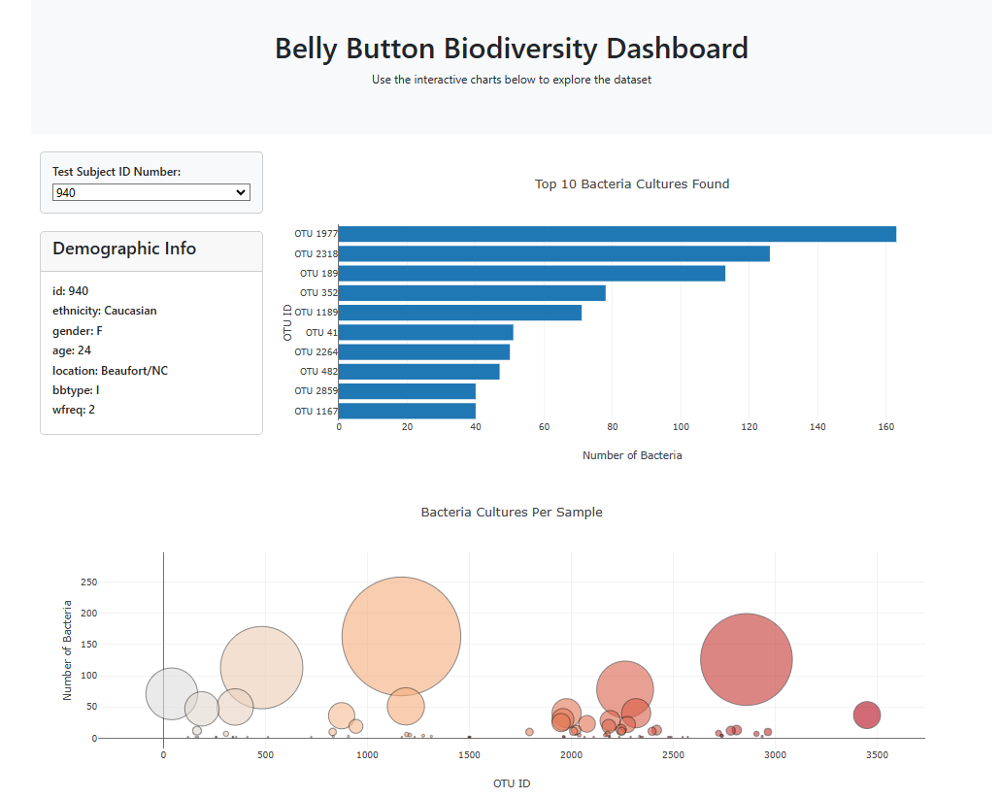

# Belly Button Biodiversity Dashboard

This interactive web dashboard was built using JavaScript to explore the Belly Button Biodiversity dataset, which contains data about the microbial species found in the belly buttons of different individuals. The dataset reveals that a small handful of microbial species (also called Operational Taxonomic Units or OTUs) are present in over 70% of people, while the remaining OTUs are much rarer.

## Features

The dashboard allows users to explore various aspects of the dataset interactively:

- **Bar Chart**: Displays the top 10 OTUs for an individual based on sample values.
- **Bubble Chart**: Shows bacteria cultures per sample, with bubble sizes representing the number of bacteria and colors representing OTU IDs.
- **Metadata Panel**: Displays demographic information for each individual, including age, ethnicity, and location.
- **Dynamic Dropdown**: Allows users to select an individual sample from a dropdown menu to update the charts and metadata.

## Project Overview

This project utilizes the **Belly Button Biodiversity** dataset, accessible at [Belly Button Biodiversity Dataset](https://robdunnlab.com/projects/belly-button-biodiversity/results-and-data/). The steps followed in this project include:

1. **Reading Data**: Load the dataset using D3.js from the provided URL.
2. **Building Charts**: 
   - Create a **horizontal bar chart** to visualize the top 10 OTUs found in a selected individual.
   - Generate a **bubble chart** that visualizes sample data in terms of OTU ID, sample size, and labels.
3. **Metadata Display**: Display an individual's demographic information based on their sample ID.
4. **Dropdown Menu**: Create a dynamic dropdown menu that allows the user to select different samples to display corresponding charts and metadata.

## Technologies Used

- **D3.js**: A JavaScript library used for creating dynamic and interactive data visualizations in the browser.
- **Plotly.js**: Used for building the interactive bubble and bar charts.
- **JavaScript (ES6)**: For logic implementation and handling user interactions.
- **HTML/CSS**: For structuring and styling the webpage.

## Instructions

### How to Use the Dashboard

1. **Clone the Repository**: Download or clone the project to your local machine.

2. **Open the Project**: Open the `index.html` file in your web browser to launch the dashboard.

3. **Select a Sample**: Use the dropdown menu to select a sample ID from the list of available samples.

4. **Explore the Data**: The bar chart, bubble chart, and metadata panel will update automatically based on the selected sample.

### Project Code Overview

The following steps are followed in the code:

1. **Data Loading**:
   - The `samples.json` file is loaded using D3's `d3.json()` method from the provided URL.
   - The data is then used to populate both the bar chart and the bubble chart.

2. **Building the Metadata Panel**:
   - The metadata for the selected individual sample is retrieved and displayed using D3's `d3.select()` to manipulate the DOM.
   - Each key-value pair from the metadata is appended to the `#sample-metadata` panel dynamically.

   ```javascript
   function buildMetadata(sample) {
     d3.json("https://static.bc-edx.com/data/dl-1-2/m14/lms/starter/samples.json").then((data) => {
       const metadata = data.metadata;
       const result = metadata.filter(meta => meta.id == sample)[0];
       const panel = d3.select("#sample-metadata");
       panel.html("");
       Object.entries(result).forEach(([key, value]) => {
         panel.append("h6").text(`${key}: ${value}`);
       });
     });
   }

3. **Building the Charts**:
  - Bubble Chart: Each sample is represented by a bubble, with otu_ids on the x-axis, sample_values on the y-axis, and otu_labels as hover text.
  - Bar Chart: A horizontal bar chart shows the top 10 OTUs, where sample_values are used for the bar lengths, otu_ids for the labels, and otu_labels for the hover text.


4. **Dropdown Menu Interaction**:

  - The dropdown allows users to select a sample ID, triggering an update of the charts and metadata for the selected individual.

## How to Run the Project

### 1. Clone the repository:

https://github.com/msmith150/belly-button-challenge.git

### 2. Open the index.html file in your web browser.

### 3. Select a sample from the dropdown to explore the data.

## Screenshots




## Conclusion
This interactive dashboard provides a detailed, user-friendly way to explore the microbial diversity in human belly buttons, offering insights into the OTUs present in various samples. Through visualizations like the bar chart and bubble chart, users can easily compare data across different individuals, while the metadata panel provides demographic information for deeper understanding.